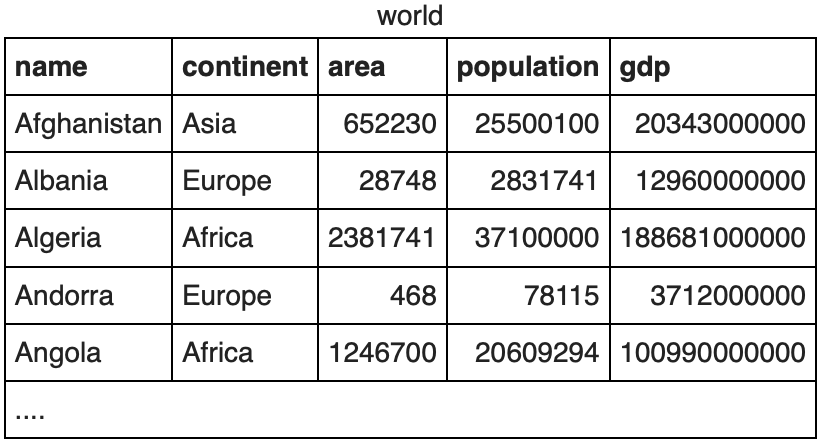

# SQLZOO Solutions
Practice SQL exercises. Solutions to [SQLZOO Tutorials](https://sqlzoo.net) posted May 2020.

## Sections
* [0 SELECT basics](#0-select-basics)
* [1 SELECT name](#1-select-name)
* 2 SELECT from World
* 3 SELECT from Nobel
* 4 SELECT within SELECT
* 5 SUM and COUNT
* 6 JOIN
* 7 More JOIN operations
* 8 Using Null
* 8+ Numeric Examples
* 9- Window function
* 9+ COVID 19 😷
* 9 Self join
* 10 Tutorial Quizzes
* 11 Tutorial Student Records
* 12 Tutorial DDL

## 0 SELECT basics


1. Show the population of Germany.
```sql
SELECT population 
FROM world
WHERE name = 'Germany';
```
2. Show the name and population for Sweden, Norway and Denmark.
```sql
SELECT name, population 
FROM world
WHERE name in ('Sweden', 'Norway','Denmark');
```
3. Show the country and area for countries with an area between 200,000 and 250,000.
```sql
SELECT name, area 
FROM world
WHERE area BETWEEN 200000 AND 250000;
```
## 1 SELECT name

