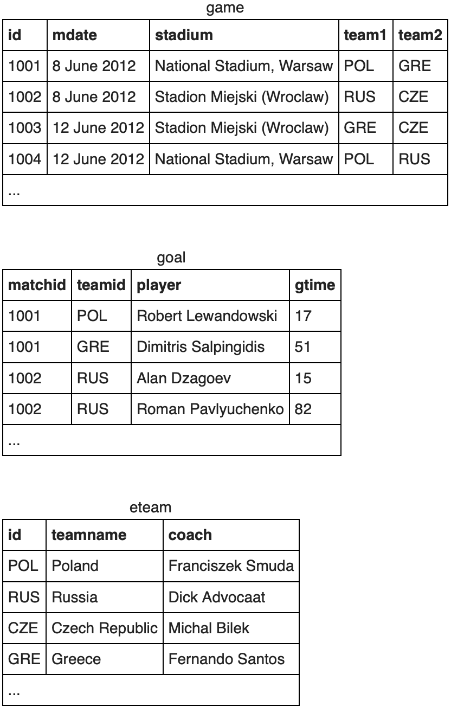
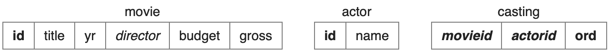
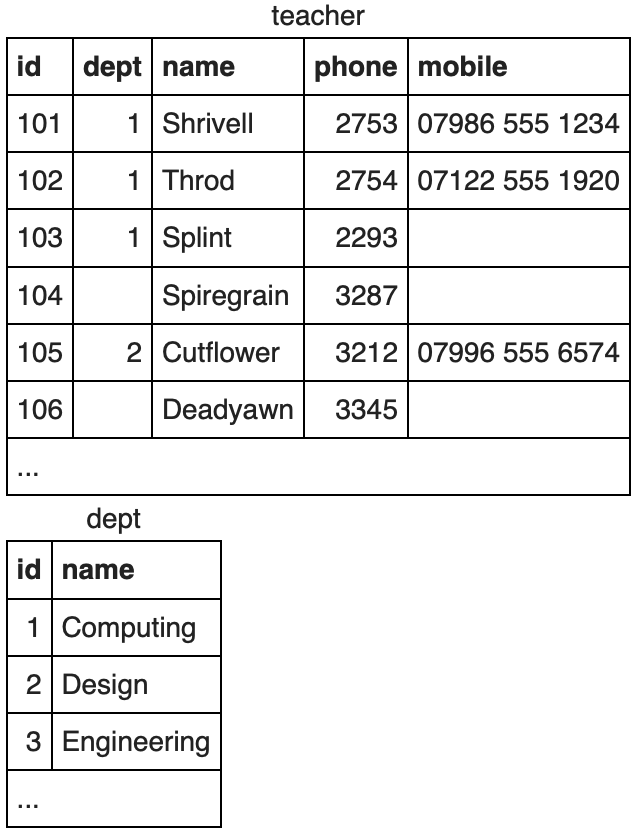

# SQLZOO Solutions
Solutions to [SQLZOO Tutorials](https://sqlzoo.net) posted May 2020.

## Sections
* [0 SELECT basics](#0-select-basics)
* [1 SELECT name](#1-select-name)
* [2 SELECT from World](#2-select-from-world)
* [3 SELECT from Nobel](#3-select-from-nobel)
* [4 SELECT within SELECT](#4-select-within-select)
* [5 SUM and COUNT](#5-sum-and-count)
* [6 JOIN](#6-join)
* [7 More JOIN operations](#7-more-join-operations)
* [8 Using Null](#8-using-null)
* [8+ Numeric Examples](#8-numeric-examples)
* [9- Window function](#9--window-function)
* [9+ COVID 19](#9-covid-19) 😷
* [9 Self join](#9-self-join)
* [10 Tutorial Quizzes](#10-tutorial-quizzes)
* [11 Tutorial Student Records](#11-tutorial-student-records)
* [12 Tutorial DDL](#12-tutorial-ddl)

## [0 SELECT basics](https://sqlzoo.net/wiki/SELECT_basics)


1. Show the population of Germany.
```sql
SELECT population 
FROM world
WHERE name = 'Germany';
```
2. Show the name and population for Sweden, Norway and Denmark.
```sql
SELECT name, population 
FROM world
WHERE name IN ('Sweden', 'Norway','Denmark');
```
3. Show the country and area for countries with an area between 200,000 and 250,000.
```sql
SELECT name, area 
FROM world
WHERE area BETWEEN 200000 AND 250000;
```
## [1 SELECT name](https://sqlzoo.net/wiki/SELECT_names)
1. Find the country that start with "Y".
```sql
SELECT name
FROM world
WHERE name LIKE 'Y%';
```
2. Find the countries that end with "y".
```sql
SELECT name 
FROM world
WHERE name LIKE '%y';
```
3. Find the countries that contain the letter "x".
```sql
SELECT name 
FROM world
WHERE name LIKE '%x%';
```
4. Find the countries that end with "land".
```sql
SELECT name 
FROM world
WHERE name LIKE '%land';
```
5. Find the countries that start with "C" and end with "ia".
```sql
SELECT name 
FROM world
WHERE name LIKE 'C%' AND name LIKE '%ia';
```
6. Find the country that has "oo" in the name.
```sql
SELECT name 
FROM world
WHERE name LIKE '%oo%';
```
7. Find the countries that have three or more "a" in the name.
```sql
SELECT name 
FROM world
WHERE name LIKE '%a%a%a%';
```
8. Find the countries that have "t" as the second character.
```sql
SELECT name 
FROM world
WHERE name LIKE '_t%';
```
9. Find the countries that have two "o" characters separated by two others.
```sql
SELECT name 
FROM world
WHERE name LIKE '%o__o%';
```
10. Find the countries that have exactly four characters.
```sql
SELECT name 
FROM world
WHERE name LIKE '____';
```
11. Find the country where the name is the capital city.
```sql
SELECT name
FROM world
WHERE name = capital;
```
12. Find the country where the capital is the country plus "City".
```sql
SELECT name
FROM world
WHERE capital = CONCAT(name, ' City');
```
13. Find the capital and the name where the capital includes the name of the country.
```sql
SELECT capital, name
FROM world
WHERE capital LIKE CONCAT('%', name, '%');
```
14. Find the capital and the name where the capital is an extension of name of the country.
```sql
SELECT capital, name
FROM world
WHERE capital LIKE CONCAT(name, '_%');
```
15. Show the name and the extension where the capital is an extension of name of the country. (For Monaco-Ville the name is Monaco and the extension is -Ville.)
```sql
SELECT name, REPLACE(capital, name, '')
FROM world
WHERE capital LIKE CONCAT(name,'_%');
```
## [2 SELECT from World](https://sqlzoo.net/wiki/SELECT_from_WORLD_Tutorial)
1. Show the name, continent and population of all countries.
```sql
SELECT name, continent, population 
FROM world;
```
2. Show the name for the countries that have a population of at least 200 million.
```sql
SELECT name 
FROM world
WHERE population >= 200000000;
```
3. Show the name and per capita GDP for those countries with a population of at least 200 million.
```sql
SELECT name, gdp/population
FROM world
WHERE population >= 200000000;
```
4. Show the name and population in millions for the countries of the continent South America. 
```sql
SELECT name, population/1000000
FROM world
WHERE continent = 'South America';
```
5. Show the name and population for France, Germany, Italy.
```sql
SELECT name, population
FROM world
WHERE name IN ('France', 'Germany', 'Italy');
```
6. Show the countries which have a name that includes the word "United".
```sql
SELECT name
FROM world
WHERE name LIKE '%United%';
```
7. Show the countries that are big by area (more than 3 million) or big by population (more than 250 million). Show name, population and area.
```sql
SELECT name, population, area
FROM world
WHERE area > 3000000 OR population > 250000000;
```
8. Show the countries that are big by area (more than 3 million) or big by population (more than 250 million) but not both. Show name, population and area.
```sql
SELECT name, population, area
FROM world
WHERE (area > 3000000 AND population <250000000) 
OR (area < 3000000 AND population > 250000000);
```
9. For South America show population in millions and GDP in billions (round both to 2 decimal places).
```sql
SELECT name, ROUND(population/1000000, 2), ROUND(gdp/1000000000, 2)
FROM world
WHERE continent = 'South America';
```
10. Show per-capita GDP for the trillion dollar countries to the nearest 1000.
```sql
SELECT name, ROUND(gdp/population, -3)
FROM world
WHERE gdp >= 1000000000000;
```
11. Show the name and capital where the name and the capital have the same number of characters.
```sql
SELECT name, capital 
FROM world 
WHERE LEN(name) = LEN(capital);
```
12. Show the name and the capital where the first letters of each match. Don't include countries where the name and the capital are the same word.
```sql
SELECT name, capital
FROM world
WHERE LEFT(name, 1) = LEFT(capital, 1)) 
AND name <> capital;
```
13. Find the country that has all the vowels and no spaces in its name.
```sql
SELECT name
FROM world
WHERE name LIKE '%a%'
AND name LIKE '%e%'
AND name LIKE '%i%'
AND name LIKE '%o%'
AND name LIKE '%u%'
AND name NOT LIKE '% %';
```

## [3 SELECT from Nobel](https://sqlzoo.net/wiki/SELECT_from_Nobel_Tutorial)


1. Display Nobel prizes for 1950.
```sql
SELECT yr, subject, winner
FROM nobel
WHERE yr = 1950;
```
2. Show who won the 1962 prize for Literature.
```sql
SELECT winner
FROM nobel
WHERE yr = 1962
AND subject = 'Literature';
```
3. Show the year and subject that won Albert Einstein his prize.
```sql
SELECT yr, subject
FROM nobel
WHERE winner = 'Albert Einstein';
```
4. Give the name of the Peace winners since the year 2000, including 2000.
```sql
SELECT winner
FROM nobel
WHERE subject = 'Peace'
AND yr >= 2000;
```
5. Show all details (yr, subject, winner) of the Literature prize winners for 1980 to 1989 inclusive.
```sql
SELECT *
FROM nobel
WHERE subject = 'Literature'
AND yr BETWEEN 1980 AND 1989;
```
6. Show all details of the presidential winners: Theodore Roosevelt, Woodrow Wilson, Jimmy Carter, Barack Obama.
```sql
SELECT * 
FROM nobel
WHERE winner IN ('Theodore Roosevelt', 'Woodrow Wilson', 'Jimmy Carter', 'Barack Obama');
```
7. Show the winners with first name John.
```sql
SELECT winner
FROM nobel
WHERE winner LIKE 'John %';
```
8. Show the year, subject, and name of Physics winners for 1980 together with the Chemistry winners for 1984.
```sql
SELECT *
FROM nobel
WHERE (subject = 'Physics' AND yr = 1980)
OR (subject = 'Chemistry' AND yr = 1984);
```
9. Show the year, subject, and name of winners for 1980 excluding Chemistry and Medicine.
```sql
SELECT *
FROM nobel
WHERE yr = 1980 
AND subject NOT IN ('Chemistry', 'Medicine');
```
10. Show year, subject, and name of people who won a Medicine prize before 1910 (not including 1910) together with winners of a Literature prize after 2004 (including 2004).
```sql
SELECT *
FROM nobel
WHERE (subject = 'Medicine' AND yr < 1910)
OR (subject = 'Literature' AND yr >= 2004);
```
11. Find all details of the prize won by Peter Grünberg.
```sql
SELECT *
FROM nobel
WHERE winner = 'Peter Grünberg';
```
12. Find all details of the prize won by Eugene O'Neill.
```sql
SELECT *
FROM nobel
WHERE winner = 'Eugene O''Neill';
```
13. List the winners, year and subject where the winner starts with Sir. Show the the most recent first, then by name order.
```sql
SELECT winner, yr, subject
FROM nobel
WHERE winner LIKE 'Sir %'
ORDER BY yr DESC, winner;
```
14. Show the 1984 winners and subject ordered by subject and winner name; but list Chemistry and Physics last.
```sql
SELECT winner, subject
FROM nobel
WHERE yr = 1984
ORDER BY 
CASE WHEN subject IN ('Physics', 'Chemistry') THEN 1 ELSE 0 END, 
subject, winner;
```

## [4 SELECT within SELECT](https://sqlzoo.net/wiki/SELECT_within_SELECT_Tutorial)
1. List each country name where the population is larger than that of Russia.
```sql
SELECT name 
FROM world
WHERE population > (SELECT population 
                    FROM world
                    WHERE name = 'Russia');
```
2. Show the countries in Europe with a per capita GDP greater than United Kingdom's.
```sql
SELECT name 
FROM world
WHERE continent = 'Europe'
AND gdp/population > (SELECT gdp/population
                      FROM world
                      WHERE name = 'United Kingdom');
```
3. List the name and continent of countries in the continents containing either Argentina or Australia. Order by name of the country.
```sql
SELECT name, continent
FROM world
WHERE continent IN (SELECT continent 
                    FROM world 
                    WHERE name IN ('Argentina', 'Australia'))
ORDER BY name;
```
4. Which country has a population that is more than Canada but less than Poland? Show the name and the population.
```sql
SELECT name, population
FROM world
WHERE population > (SELECT population 
                    FROM world 
                    WHERE name = 'Canada')
AND population < (SELECT population 
                  FROM world 
                  WHERE name = 'Poland');
```
5. Show the name and the population of each country in Europe. Show the population as a percentage of the population of Germany.
```sql
SELECT name, 
       CONCAT(CAST(ROUND(population/(SELECT population
                                     FROM world 
                                     WHERE name = 'Germany')
                         *100, 0) AS int), '%') AS percentage
FROM world
WHERE continent = 'Europe';
```
6. Which countries have a GDP greater than every country in Europe? 
```sql
SELECT name
FROM world
WHERE gdp > (SELECT MAX(gdp) 
             FROM world 
             WHERE continent = 'Europe');
```
7. Find the largest country (by area) in each continent, show the continent, the name and the area.
```sql
SELECT continent, name, area
FROM world
WHERE area IN (SELECT MAX(area) 
               FROM world 
               GROUP BY continent);
```
8. List each continent and the name of the country that comes first alphabetically.
```sql
SELECT continent, name
FROM world
WHERE name IN (SELECT MIN(name) 
               FROM world 
               GROUP BY continent);
```
9. Find the continents where all countries have a population <= 25,000,000. Then find the names of the countries associated with these continents. Show name, continent and population.
```sql
SELECT name, continent, population
FROM world AS x
WHERE 25000000 >= ALL(SELECT population 
                      FROM world AS y 
                      WHERE x.continent = y.continent 
                      AND population IS NOT NULL);
```
10. Some countries have populations more than three times that of any of their neighbours (in the same continent). Give the countries and continents.
```sql
SELECT name, continent 
FROM world AS x 
WHERE population > ALL(SELECT population*3 
                       FROM world AS y 
                       WHERE y.continent = x.continent 
                       AND y.name <> x.name);
```

## [5 SUM and COUNT](https://sqlzoo.net/wiki/SUM_and_COUNT)
1. Show the total population of the world.
```sql
SELECT SUM(population)
FROM world;
```
2. List all the continents.
```sql
SELECT DISTINCT continent
FROM world;
```
3. Show the total GDP of Africa.
```sql
SELECT SUM(gdp)
FROM world
WHERE continent = 'Africa';
```
4. How many countries have an area of at least 1,000,000?
```sql
SELECT COUNT(name)
FROM world
WHERE area >= 1000000;
```
5. What is the total population of Estonia, Latvia, and Lithuania?
```sql
SELECT SUM(population)
FROM world
WHERE name IN ('Estonia', 'Latvia', 'Lithuania');
```
6. For each continent show the continent and number of countries.
```sql
SELECT continent, COUNT(name)
FROM world
GROUP BY continent;
```
7. For each continent show the continent and number of countries with populations of at least 10 million.
```sql
SELECT continent, COUNT(name)
FROM world
WHERE population >= 10000000
GROUP BY continent;
```
8. List the continents that have a total population of at least 100 million.
```sql
SELECT continent
FROM world
GROUP BY continent
HAVING SUM(population) >= 100000000;
```

## [6 JOIN](https://sqlzoo.net/wiki/The_JOIN_operation)


1. Show the matchid and player name for all goals scored by Germany (teamid = "GER").
```sql
SELECT matchid, player
FROM goal 
WHERE teamid = 'GER';
```
2. Show id, stadium, team1, team2 for game 1012.
```sql
SELECT id, stadium, team1, team2
FROM game
WHERE id = '1012';
```
3. Show the player, teamid, stadium and mdate for every German goal.
```sql
SELECT player, teamid, stadium, mdate
FROM game 
JOIN goal ON game.id = goal.matchid
WHERE teamid = 'GER';
```
4. Show the team1, team2 and player for every goal scored by player called Mario.
```sql
SELECT team1, team2, player
FROM game 
JOIN goal ON game.id = goal.matchid
WHERE player LIKE 'Mario%';
```
5. Show player, teamid, coach, gtime for all goals scored in the first 10 minutes (gtime <= 10).
```sql
SELECT player, teamid, coach, gtime
FROM goal 
JOIN eteam ON goal.teamid = eteam.id
WHERE gtime <= 10;
```
6. List the dates of the matches and the name of the team in which Fernando Santos was the team1 coach.
```sql
SELECT mdate, teamname
FROM game 
JOIN eteam ON game.team1 = eteam.id
WHERE coach = 'Fernando Santos';
```
7. List the player for every goal scored in a game where the stadium was "National Stadium, Warsaw".
```sql
SELECT player
FROM game 
JOIN goal ON game.id = goal.matchid
WHERE stadium = 'National Stadium, Warsaw';
```
8. Show the name of all players who scored a goal against Germany.
```sql
SELECT DISTINCT player
FROM goal
JOIN game ON goal.matchid = game.id
WHERE teamid <> 'GER' AND (team1 = 'GER' OR team2 = 'GER');
```
9. Show teamname and the total number of goals scored.
```sql
SELECT teamname, COUNT(*)
FROM goal
JOIN eteam ON goal.teamid = eteam.id
GROUP BY teamname;
```
10. Show the stadium and the number of goals scored in each stadium.
```sql
SELECT stadium, COUNT(*)
FROM game
JOIN goal ON game.id = goal.matchid
GROUP BY stadium;
```
11. For every match involving "POL", show the matchid, date and the number of goals scored.
```sql
SELECT matchid, mdate, COUNT(*)
FROM game
JOIN goal ON game.id = goal.matchid
WHERE team1 = 'POL' OR team2 = 'POL'
GROUP BY matchid, mdate;
```
12. For every match where "GER" scored, show matchid, match date and the number of goals scored by "GER".
```sql
SELECT matchid, mdate, COUNT(*)
FROM game
JOIN goal ON game.id = goal.matchid
WHERE teamid = 'GER'
GROUP BY matchid, mdate;
```
13. List every match with the goals scored by each team as shown.
```sql
SELECT mdate, team1, SUM(CASE WHEN teamid = team1 THEN 1 ELSE 0 END) AS score1, 
       team2, SUM(CASE WHEN teamid = team2 THEN 1 ELSE 0 END) AS score2
FROM game
LEFT JOIN goal ON game.id = goal.matchid
GROUP BY mdate, matchid, team1, team2;
```

## [7 More JOIN operations](https://sqlzoo.net/wiki/More_JOIN_operations)


1. List the films where the yr is 1962. Show id and title.
```sql
SELECT id, title
FROM movie
WHERE yr = '1962';
```
2. When was Citizen Kane released?
```sql
SELECT yr
FROM movie
WHERE title = 'Citizen Kane';
```
3. List all of the Star Trek movies, include the id, title and yr (all of these movies include the words Star Trek in the title). Order results by year.
```sql
SELECT id, title, yr
FROM movie
WHERE title LIKE '%Star Trek%'
ORDER BY yr;
```
4. What's the id for actor Glenn Close?
```sql
SELECT id
FROM actor
WHERE name = 'Glenn Close';
```
5. What's the id of the film Casablanca?
```sql
SELECT id
FROM movie
WHERE title = 'Casablanca';
```
6. Obtain the cast list for Casablanca.
```sql
SELECT name
FROM actor
JOIN casting ON actor.id = casting.actorid
WHERE movieid = (SELECT id 
                 FROM movie 
                 WHERE title = 'Casablanca');
```
7. Obtain the cast list for the film Alien.
```sql
SELECT name
FROM movie, actor, casting
WHERE title = 'Alien'
AND actor.id = casting.actorid
AND casting.movieid = movie.id;
```
8. List the films in which Harrison Ford has appeared.
```sql
SELECT title
FROM movie, actor, casting
WHERE name = 'Harrison Ford'
AND actor.id = casting.actorid
AND casting.movieid = movie.id;
```
9. List the films in which Harrison Ford has appeared but not in the starring role. (The ord field indicates the position of the actor. If ord = 1 then the actor is in the starring role.)
```sql
SELECT title
FROM movie, actor, casting
WHERE name = 'Harrison Ford'
AND actor.id = casting.actorid
AND casting.movieid = movie.id
AND ord <> '1';
```
10. List the films together with the leading star for all 1962 films.
```sql
SELECT title, name
FROM movie, actor, casting
WHERE yr = '1962'
AND actor.id = casting.actorid
AND casting.movieid = movie.id
AND ord = 1;
```
11. Which were the busiest years for Rock Hudson? Show the year and the number of movies he made each year for any year in which he made more than two movies.
```sql
SELECT yr, COUNT(title)
FROM movie
JOIN actor ON movie.id = actor.id
JOIN casting ON movie.id = casting.movieid
WHERE name = 'Rock Hudson'
GROUP BY yr
HAVING COUNT(title) > 2;
```
12. List the film title and the leading actor for all of the films Julie Andrews played in.
```sql
SELECT title, name
FROM movie, actor, casting
WHERE movie.id IN (SELECT movie.id
                FROM movie, actor, casting 
                WHERE name = 'Julie Andrews'
                AND actor.id = casting.actorid
                AND casting.movieid = movie.id)
AND actor.id = casting.actorid
AND casting.movieid = movie.id
AND ord = 1;
```
13. Obtain a list, in alphabetical order, of actors who've had at least 15 starring roles.
```sql
SELECT name
FROM actor
JOIN casting ON actor.id = casting.actorid
WHERE ord = 1
GROUP BY name
HAVING COUNT(name) >= 15;
```
14. List the films released in the year 1978 ordered by the number of actors in the cast, then by title.
```sql
SELECT title, COUNT(actorid)
FROM movie, casting
WHERE yr = '1978'
AND casting.movieid = movie.id
GROUP BY title
ORDER BY 2 DESC, 1;
```
15. List all the people who have worked with Art Garfunkel.
```sql
SELECT DISTINCT name
FROM actor, casting
WHERE actor.id = casting.actorid
AND name <> 'Art Garfunkel'
AND movieid IN (SELECT movieid
                FROM actor, casting
                WHERE name = 'Art Garfunkel'
                AND actor.id = casting.actorid);
```

## [8 Using Null](https://sqlzoo.net/wiki/Using_Null)


1. List the teachers who have NULL for their department.
```sql
SELECT name
FROM teacher
WHERE dept IS NULL;
```
2. Note the INNER JOIN misses the teachers with no department and the departments with no teacher.
```sql
SELECT teacher.name, dept.name
FROM teacher 
INNER JOIN dept ON (teacher.dept = dept.id);
```
3. Use a different JOIN so that all teachers are listed.
```sql
SELECT teacher.name, dept.name
FROM teacher 
LEFT JOIN dept ON (teacher.dept = dept.id);
```
4. Use a different JOIN so that all departments are listed.
```sql
SELECT teacher.name, dept.name
FROM teacher 
RIGHT JOIN dept ON (teacher.dept = dept.id);
```
5. Use COALESCE to print the mobile number. Use the number "07986 444 2266" if there is no number given. Show teacher name and mobile number.
```sql
SELECT name, COALESCE(mobile, '07986 444 2266')
FROM teacher;
```
6. Use the COALESCE function and a LEFT JOIN to print the teacher name and department name. Use the string "None" where there is no department.
```sql
SELECT teacher.name, COALESCE(dept.name, 'None')
FROM teacher
LEFT JOIN dept ON teacher.dept = dept.id;
```
7. Use COUNT to show the number of teachers and the number of mobile phones.
```sql
SELECT COUNT(name), COUNT(mobile)
FROM teacher;
```
8. Use COUNT and GROUP BY dept.name to show each department and the number of staff. Use a RIGHT JOIN to ensure that the Engineering department is listed.
```sql
SELECT dept.name, COUNT(teacher.name)
FROM teacher
RIGHT JOIN dept ON teacher.dept = dept.id
GROUP BY dept.name;
```
9. Use CASE to show the name of each teacher followed by "Sci" if the teacher is in dept 1 or 2 and "Art" otherwise.
```sql
SELECT name, (CASE WHEN dept IN ('1', '2') THEN 'Sci' ELSE 'Art' END)
FROM teacher;
```
10. Use CASE to show the name of each teacher followed by "Sci" if the teacher is in dept 1 or 2, show "Art" if the teacher's dept is 3 and "None" otherwise.
```sql
SELECT name, CASE WHEN dept IN (1,2) 
THEN 'Sci'
WHEN dept = 3 
THEN 'Art'
ELSE 'None' END
FROM teacher;
```

## [8+ Numeric Examples](https://sqlzoo.net/wiki/NSS_Tutorial)
## [9- Window function](https://sqlzoo.net/wiki/Window_functions)
## [9+ COVID 19](https://sqlzoo.net/wiki/Window_LAG)
## [9 Self join](https://sqlzoo.net/wiki/Self_join)
## [10 Tutorial Quizzes](https://sqlzoo.net/wiki/Tutorial_Quizzes)
## [11 Tutorial Student Records](https://sqlzoo.net/wiki/DDL_Student_Records)
## [12 Tutorial DDL](https://sqlzoo.net/wiki/DDL_General_Election)
